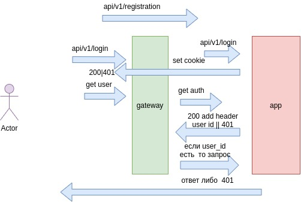

1. minikube start 
2. minikube addon enable ingress
3. kubectl apply -f app

в файле otus homewwork 5.postman_collection.json коллекция постман для проверки

сценарий 
1. регистрация
2. аутентификация на этом этапе создается кука с ключем сессии
3. запрос ресурсов из api/v1/user/* происходит запрос доступа, 
если проверка прошла возвращается header x-user-id с ид пользователя
4. gateway перенаправляет запрос сервису с данным получеными выше
5. на шаге 2,3,4 проверка не прошла либо не хватает полномоций для изменения возвращается ошибка 401
